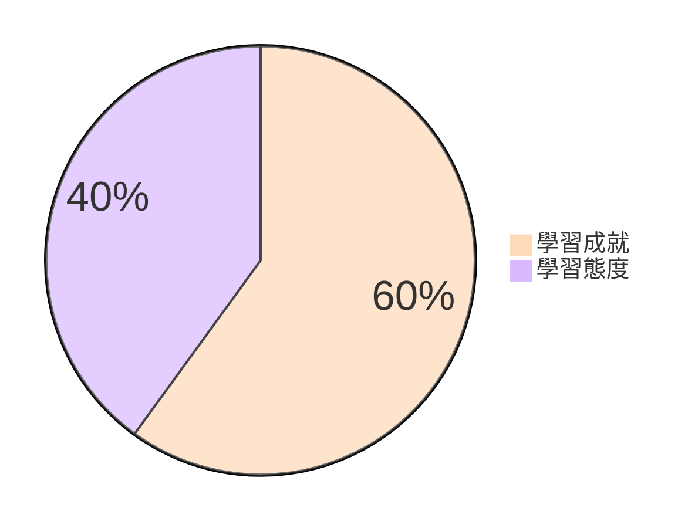

# 分數計算與課程路徑

## 選擇你如何度過本學期

---

# 分數計算

::div {.w-135 .-mt-6 .mx-auto}

::

---

# 分數計算（續）

::div{.h-full .grid .grid-cols-2}

**學習成就** {.text-5xl}

:::v-clicks
::::ul{.pl-28 .pt-6 .space-y-6}
* 平時作業
* 期中（看課程路徑）
* 期末
::::
:::

**學習態度** {.text-5xl}

:::v-clicks
::::ul{.pl-30 .pt-6 .space-y-6}
* 印象分數
* 救你用的
* **天堂島**{.text-rose-600}
::::
:::

::

---

# 開始講解之前...

::center-block
:::p{.text-4xl .mb-8}
每一個路徑**學習成就配分**{.text-rose-600 .text-5xl}有點不同， 
:::

:::p{.text-4xl}
你一定要**專心聽**{.text-rose-600}、**做筆記**{.text-rose-600}。 
:::
::

---
layout: image
---

# 開始講解之前...（續）r

---
layout: image
---

# 開始講解之前...（續）

---

# 本學期課程路徑

::ul {.pt-4 .pl-16}
* 課本課程
* Python 演算法
* Python 遊戲設計
* 網路安全
::

---

# 課本課程

顧名思義，就是上課本內容。

