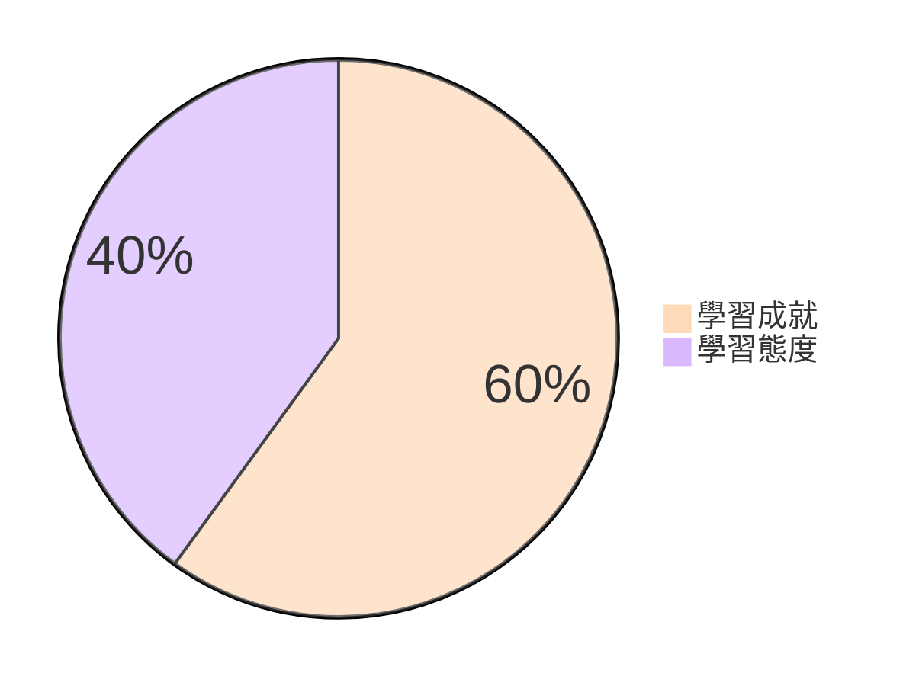
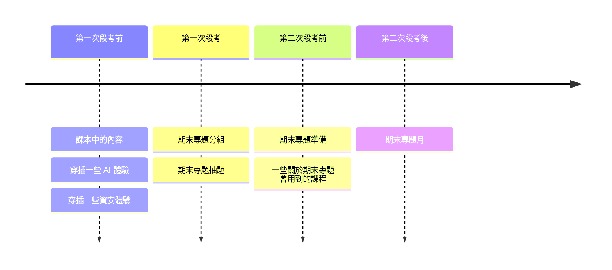
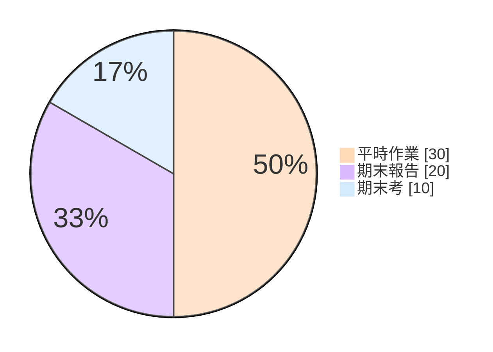
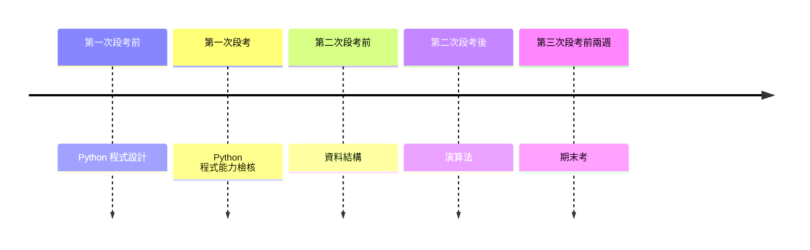
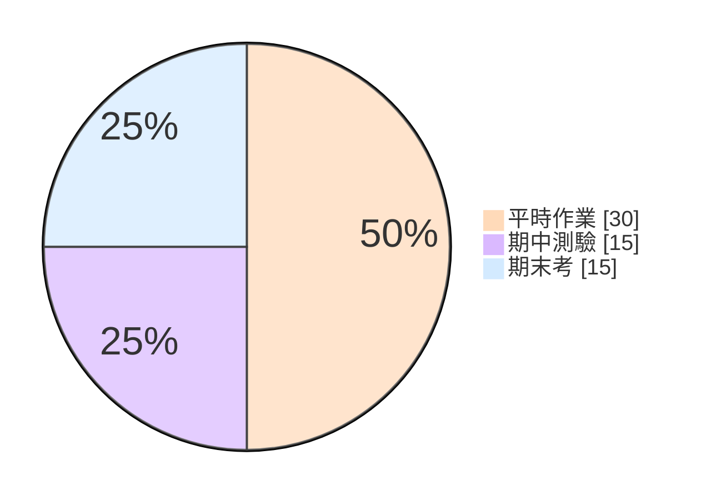
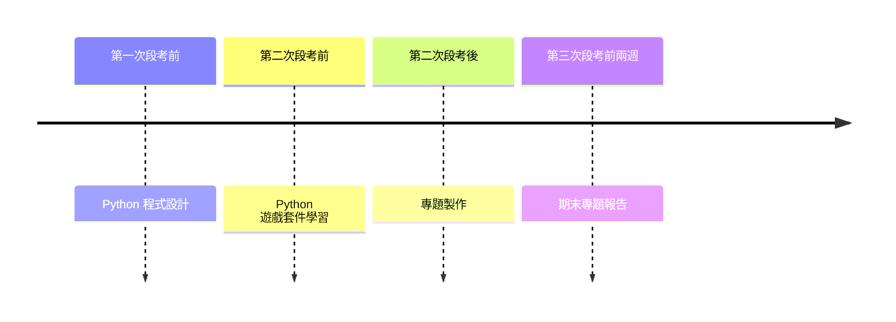
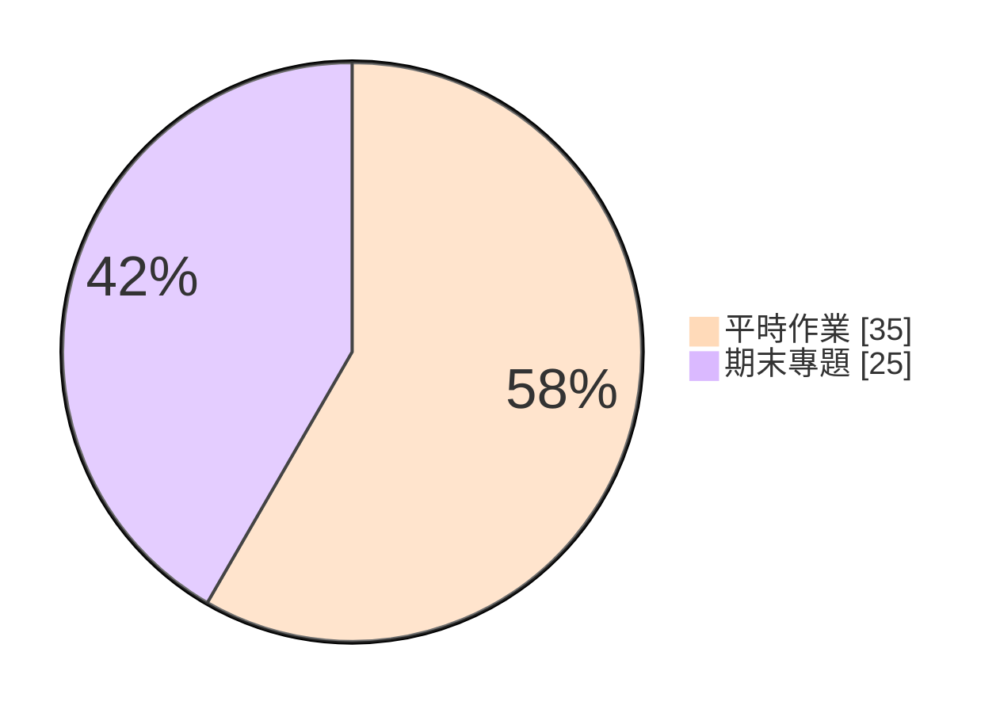
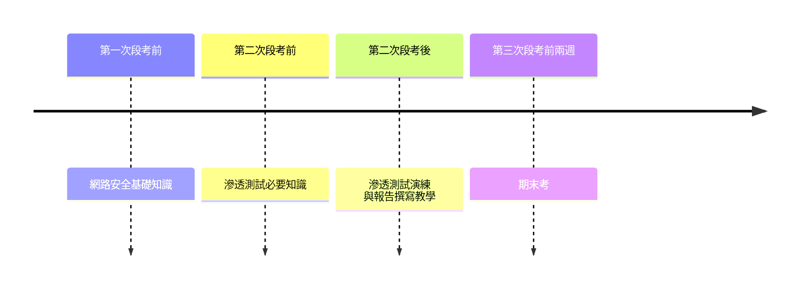

# 分數計算與課程路徑

## 選擇你如何度過本學期

---

# 分數計算

::div {.w-135 .-mt-6 .mx-auto}

::

---

# 分數計算（續）

::div{.h-full .grid .grid-cols-2}

**學習成就** {.text-5xl}

:::v-clicks
::::ul{.pl-28 .pt-6 .space-y-6}
* 平時作業
* 期中（看課程路徑）
* 期末
::::
:::

**學習態度** {.text-5xl}

:::v-clicks
::::ul{.pl-30 .pt-6 .space-y-6}
* 印象分數
* 救你用的
* **天堂島**{.text-rose-600}
::::
:::

::

---

# 分數計算（續）

## 本學期特別加分

### 穿著校服（最高加學期總分 10 分）

計算方式：{.pl-6 .pt-4}
::ul{.pl-18}
- 穿著一次，統計次數 +1；未穿則統計次數 -1。
- 學期結束時穿著校服的最高次數與最低次數進行內插法計算。
::

---

# 開始講解之前...

::center-block
:::p{.text-4xl .mb-8}
每一個路徑**學習成就配分**{.text-rose-600 .text-5xl}有點不同， 
:::

:::p{.text-4xl}
你一定要**專心聽**{.text-rose-600}、**做筆記**{.text-rose-600}。 
:::
::

---
layout: image
---

# 開始講解之前...（續）

---
layout: image
---

# 開始講解之前...（續）

---

# 本學期課程路徑

::ul {.pt-4 .pl-16 .space-y-4}
* 課本課程
* Python 演算法
* Python 遊戲設計
* 網路安全
::

---

# 課本課程

顧名思義，就是上課本內容。 {.pt-4 .pl-4}

::div{.w-180 .mx-auto}

::

---

# 課本課程（續）

## 學習成就配分{.text-center}

::div {.w-115 .-mt-8 .ml-60}

::

---

# [Python]{.font-mono} 演算法

::p {.pt-4 .pl-4}
顧名思義，就是上 
[Python]{.font-mono} 
與 
演算法 的課程。
::

::div{.w-240 .mx-auto}

::

---

# [Python]{.font-mono} 演算法（續）

## 學習成就配分{.text-center}

::div {.w-115 .-mt-8 .ml-60}

::

---

# [Python]{.font-mono} 遊戲設計

::p {.pt-4 .pl-4}
學習利用 
Python{.font-mono} 
的套件來製作遊戲
::

::p{.text-lg .pl-20 .-mt-2}
暫定使用 **Pyxel**{.font-mono} 這個 **Pixel Game**{.font-mono} 套件
::

::div{.w-240 .mx-auto .-mt-6}

::

---

# [Python]{.font-mono} 遊戲設計（續）

## 學習成就配分{.text-center}

::div {.w-115 .-mt-8 .ml-60}

::

---

# 網路安全

::p {.pt-4 .pl-4}
教你做資安稽核、打 [CTF]{.font-mono}、滲透測試及撰寫滲透測試報告
::

::div{.w-240 .mx-auto .-mt-6}

::

---

# 網路安全（續）

## 學習成就配分{.text-center}

::div {.w-115 .-mt-8 .ml-60}

::

---